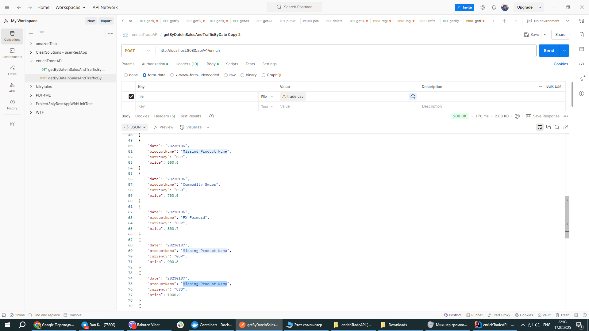
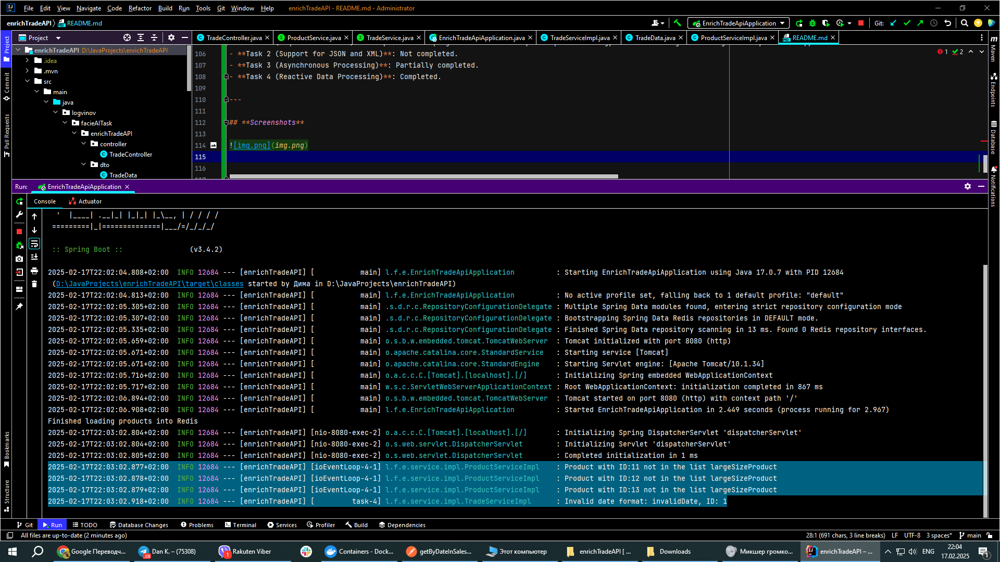



# **API Description**

**Trade Enrichment API** is a RESTful service for processing trade data, enriching it with product names from a static reference file. The service checks trade records, validates dates, and replaces product identifiers with corresponding product names. This solution allows for working with large datasets and automatically processing CSV files.

---

## 1. **How to Run the Project**

To run the project on your local machine, follow these steps:

1. **Prerequisites**:
   - Install **Docker** to run Redis and other dependencies.
   - Install **Maven** to build and run the project.

2. **Run Redis in Docker**:
   In the root directory of the project (where the `docker-compose.yml` file is located), open the terminal and run the following command:
   ```bash
   docker compose up
   ```
   This will start a container with Redis, which is used for data storage.

3. **Run the Application**:
   Once the Redis container is running, in the same terminal, from the root directory of the project, run the following command to build and start the application:
   ```bash
   mvn clean install spring-boot:run
   ```

---

## 2. **How to Use the API**

To use the API, you can either use **Postman** or execute a command in the terminal with `curl`. You will need a CSV file with data, which will be processed and enriched with product names.

### 2.1 **Example Usage with curl**:

Here is an example command to send a CSV file via the terminal:

```bash
curl -X POST http://localhost:8080/api/v1/enrich \
  -H "Content-Type: multipart/form-data" \
  -F "file=@D:/JavaProjects/enrichTradeAPI/src/main/resources/trade.csv"
```

This request will enrich the data from the `trade.csv` file based on information from the reference file `largeSizeProduct.csv`. Both files should be located in the resources folder. Please note that the file path should be updated according to the location of the file on your local machine.

### 2.2 **Example Usage with Postman**:

1. Open **Postman**.
2. Select the **POST** method.
3. Enter the URL: `http://localhost:8080/api/v1/enrich`.
4. Go to the **Body** tab.
5. Select **form-data**.
6. Add a field named `file` with the type **File**.
7. Choose the `trade.csv` file on your computer.
8. Click **Send** to send the request.

After sending the file, you will receive dynamically enriched data in JSON format.

---

## 3. **Possible Improvements**

There are several areas where improvements could be made to enhance functionality, performance, and user experience:

1. **Support for Various Input Formats**:
   - Add support for various file formats, such as CSV, JSON, and XML, to increase the flexibility of the service.

2. **Eliminate Hardcoded File Paths**:
   - Make the file paths configurable, for example, using environment variables or configuration files, to improve setup flexibility.

3. **Reference File Update Strategy**:
   - Implement a strategy for updating the `largeSizeProduct.csv` file, such as using cron jobs or monitoring changes to the file.

4. **Error and Exception Handling**:
   - Improve error handling by sending meaningful error messages and HTTP status codes. For example, add centralized exception handling using `@ControllerAdvice`.

5. **Logging**:
   - Add more detailed logging at each step of the data processing (e.g., during parsing and enrichment).
   - Use different log levels (`DEBUG`, `INFO`, `ERROR`) for more flexible log management.

   Example logging:
   ```java
   log.debug("Processing line: {}", line);
   ```

6. **Performance Optimization**:
   - Set up data buffering if dealing with large input files.

7. **Testing**:
   - Write unit tests to verify the correctness of service methods, such as parsing and enriching data.
   - Add integration tests to check interactions with external services (e.g., with the `productService`).

8. **API Documentation**:
   - To improve understanding and usability of the API, it is recommended to add documentation using **Swagger** or **OpenAPI** to automate API documentation creation and updates.

---
Вот обновленный раздел с переводом на английский и добавлением абзаца "Screenshots":

---

## 4. **Task Status**

- **Task 1 (Required Features)**: Completed. The project is successfully set up and working, Redis is configured through Docker, and the application starts without errors.
- **Task 2 (Support for JSON and XML)**: Not completed.
- **Task 3 (Asynchronous Processing)**: Partially completed.
- **Task 4 (Reactive Data Processing)**: Completed.

---

## **Screenshots**




---